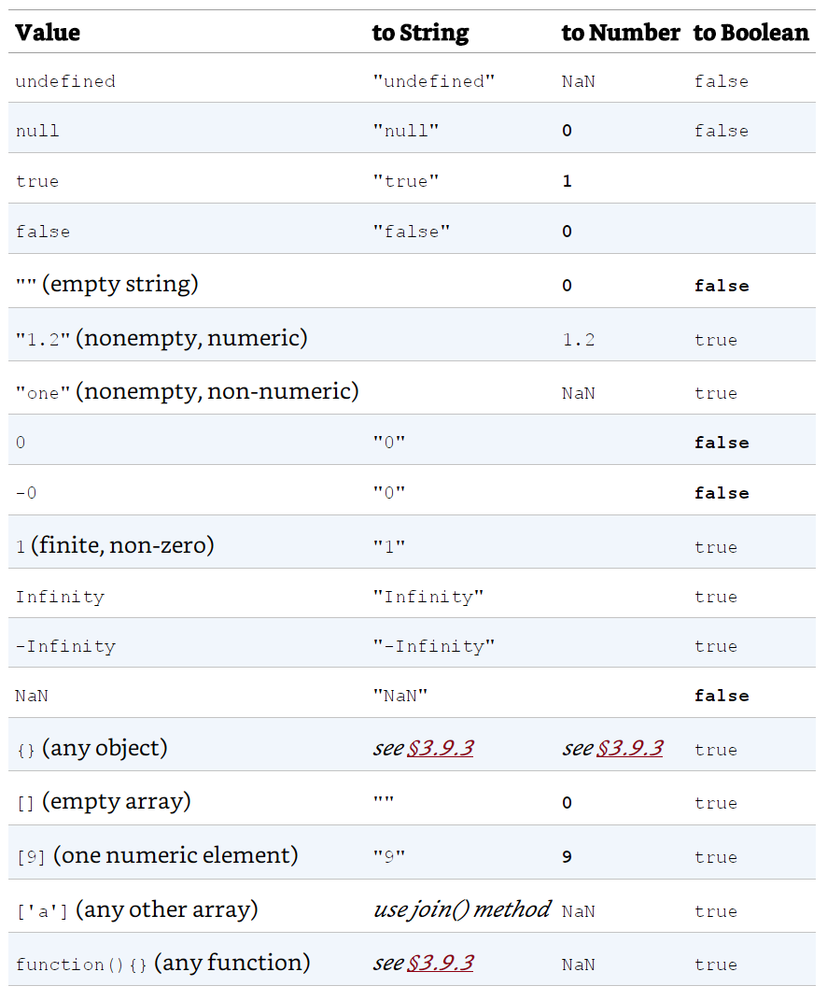

# CIDM3372

CSS and JavaScript

**NOTE**: See the Project folder for code for the final project

## CSS

[CSS in Depth by Keith J. Grant](https://www.manning.com/books/css-in-depth)

[CSS Book code respository](https://github.com/CSSInDepth/css-in-depth)

### Part 1 - Fundamentals (Chapters 1 - 3)

Basics and Box Model

### Part 2 - Mastering Layout (Chapters 4 - 8)

Mastering layout

#### Chapter 4 - Floats

Floats were originally intended to mimic text flowing around a container (usually an image).

They were the only viable tool for flexible layouts for a long time.

#### Chapter 5 - Flexbox

How containers allow for growing and shrinking.

#### Chapter 6 - Grid

Using grid to more precisely divide and specify page-wide layout.

#### Chapter 7 - Positioning

Within containers, further positioning of elements.

#### Chapter 8 - Responsive Design

Exercising more control over layout in response to viewport/device properties.

### Part 3 - CSS at Scale (Chapters 9 and 10)

How to manage CSS as projects increase in scale and scope

#### Chapter 9 - Modular CSS

> Modular CSS means breaking the page up into its component parts. These parts should be reusable in multiple contexts, and they shouldn’t directly depend upon one another. The end goal is that changes to one part of your CSS will not produce unexpected effects in another.

> ***Encapsulation*** The grouping together of related functions and data to comprise an object. It’s used to hide the state or values of a structured object so that outside parties cannot operate on them.

> * Emerging problems as a project grows
> * Organizing CSS into modules
> * Preventing escalating selector specificity
> * Surveying popular CSS methodologies

**Block, Element, Mofifier**

[BEM](https://css-tricks.com/bem-101/)

**Parsimony**

> Your modules should each be responsible for one thing. Our Message module is responsible for making a message noticeable. Our Media module is responsible for positioning an image beside some text. You should be able to concisely summarize its purpose. Some modules will be for layout, others will be for stylistic purposes. When a module tries to do more than one thing, you should consider breaking it into smaller modules.

##### CSS Methodologies

A set of guidelines to help organize your CSS:

* [Object-Oriented CSS (OOCSS)](https://github.com/stubbornella/oocss/wiki) - [Elaboration](https://www.slideshare.net/stubbornella/object-oriented-css)
* [Scalable and Modular Architecture for CSS](http://smacss.com/) - [Read about it](http://smacss.com/book/)
* [Block, Element, Modifier (BEM)](https://en.bem.info/methodology/)
* [Inverted Triangle CSS](https://www.creativebloq.com/web-design/manage-large-css-projects-itcss-101517528)

##### General Application

For your stylesheet:

* define and apply base rules
* define and apply module rules (group classes to constitute the module)
* define utility classes to be used throughout
* [SMACSS](http://smacss.com/) then suggests we specify layout components

Summarizing the advice:

* Break your CSS up into small, reusable modules.
* Never write styles that reach into another module and change its appearance.
* Use variant classes to provide multiple versions of the same module.
* Divide large constructs into smaller modules; build your pages by piecing together a number of modules.
* Group all rules for a module together in your stylesheet.
* Use a naming convention such as double-hyphens and double-underscores to make your modules’ structure easier to understand at a glance.

#### Chapter 10 - Pattern Libraries and Style Guides

Eventually, you'll find that your projects start to exhibit common needs and that you develop consistent approaches to addressing these needs.

You will apply the same solutions to these problems and the modular approach makes this easier.  As you document how to find and use your common modules, you'll develop a ***pattern library*** as a ***style guide***.

You would do so as...

> a separate set of HTML pages, showcasing each CSS module. This is a development tool that you and your team will use when building the site.

Further distinguishing Pattern Library and Style Guide:

> ***PATTERN LIBRARY VS. STYLE GUIDE***
Some pattern libraries are often called a style guide (or “living style guide”). In fact, style guide is probably the more common—there’s a distinction, however.

> The name style guide implies not only technical instruction on how to use the modules, but also opinionated direction about when and why you should or should not use them. This direction is typically for guiding a developer through requirements of the product’s branding.

> If branding instruction is relevant on your project, feel free to add it to your pattern library. But that gets into the realm of marketing rather than development. Because this chapter focuses on the technical documentation aspect, I’ll use the name pattern library instead.

#### Using KSS to Create a Pattern Library

* Install NodeJS (should be there from a previous assignment).
* Initialize a new nodejs project using the [Node Package Manager](https://docs.npmjs.com/getting-started/): `npm init -y`
* Install KSS: `npm install --save-dev kss`

## JavaScript

### Fall 2021:

Here are some new source files with new examples:

[Basics](JS-Chapters/Basics/basics.md)

[JavaScript: The Definitive Guide, 7th Edition by David Flanagan](https://www.oreilly.com/library/view/javascript-the-definitive/9781491952016/)

[JS Book code repository](https://github.com/davidflanagan/jstdg7)


### Chapter 2 Basics and Running Code

Javascript is typically run within a browser as the browser hosts scripts.  Therefore, for basic coding, we have a few options:

* Create an HTML page an then code within it to use the browser
* Use the browser's [Developer Tools](https://developers.google.com/web/tools/chrome-devtools/) to run JS code in the console there
* Use [NodeJS](https://nodejs.org/en/)

I will demonstrate each.

#### Language Basics: Lexical Structures

There are some JavaScript basics in terms of structure that are easy to work through.

#### Comments

A comment is any content in a script or page that you don't have interpreted/read by the browser.  They are for documenting code and making notes.

``` javascript
// This is a single-line comment. 
/* This is also a comment */ 

/** 
  * This is a multi-line comment. The extra * characters at the start of 
  * each line are not a required part of the syntax; they just look cool! 
  */
```

#### Literal Values

We can **hard code** values into our JS code as well

``` javascript
12 // The number twelve 
1.2 // The number one point two 
"hello world" // A string of text 
'Hi' // Another string 
true // A Boolean value 
false // The other Boolean value 
null // Absence of an object

```

#### Identifiers (variable names) and reversed workds/names

You can use letters, underscores, or dollar signs to start a variable name.  Then, you can use numbers, letters, dollar signs, or underscores:

``` javascript
i 
my_variable_name 
v13 
_dummy 
$str

```

There are reserved words, that indicate how JavaScript should work, that are not allowed to be used in your identifiers.

``` javascript
as const export get null target void 
async continue extends if of this while 
await debugger false import return throw with 
break default finally in set true yield 
case delete for instanceof static try 
catch do from let super typeof 
class else function new switch var
```

#### Unicode provides support for an extended character set

We can use symbols and languages other than english for our indentifiers:

``` javascript
const π = 3.14;   // symbol
const sí = true;  // espanol
```

We can use unicode escape sequences - by using the hexadecimal value for the unicode character/symbol:

``` javascript
console.log("\ u{ 1F600}"); // Prints a smiley face emoji
```

#### Semicolons as statement terminators

Although optional, your code is more readable and emphatic if you use them.

### Chapter 3 Types, Values, and Variables

This chapter is all about the types of data you store in a variable (identifier), as all identifiers are associated with something you want to save and refer to later.

JavaScript is, generally, not a strong-typed language which gives some flexibility as values are interpreted/assessed when your code runs.

However, there are some basic categories.

* Primitive Types
  * numbers
  * strings
  * booleans
  * null
  * undefined
* Object Types
  * everything else that is not a primitive
  * typically, a collection of properties - identifier + value
  * Arrays - a sequence of primitives or objects
  * Sets - set of values
  * Map - key/value pairs
  * RegExp - regular expression
  * Date - working with time and date
  * Error - encapsulates a code error with causes, information, and descriptions of the error
  * Classes
  * Functions

#### Interpreted Languages and Memory Management

JavaScript handles memory management and object/value disposal (called **Garbage Collection**) for you. Most JavaScript intepreters (called an *Engine*) run in a browser.

#### Object-Orientation

JavaScript is an Object-Oriented language in that you can specify classes and prototypes from which you may then generate objects.  Then, you can *contain* variables in one place.

#### Declaration of Variables

There are, generally, three ways that you declare that you'd like to store a value with an identifier:

  * `const` - declaring a value that you do not want to change for its lifetime
  * `let` - declaring a value that can change during its lifetime
  * `var`- older way of using `let` - will be commonly found in older JavaScript code.  It still works.

  David Flanagan has this to say about when to use `const` and when to use `let`:

  > There are two schools of thought about the use of the const keyword. One approach is to use const only for values that are fundamentally unchanging, like the physical constants shown, or program version numbers, or byte sequences used to identify file types, for example. Another approach recognizes that many of the so-called variables in our program don’t actually ever change as our program runs. In this approach, we declare everything with const, and then if we find that we do actually want to allow the value to vary, we switch the declaration to let. This may help prevent bugs by ruling out accidental changes to variables that we did not intend. In one approach, we use const only for values that must not change. In the other, we use const for any value that does not happen to change. I prefer the former approach in my own code.

  > David Flanagan - JavaScript: The Definitive Guide - 8th Edition, Page 53

#### The Primitive Types

The primitive types cover most of the values you'd expect to encounter and store.  Object types are often collections of these values.

JavasScript uses the IEEE 754 standard to hold numbers as 64-bit floating point or 32-bit integer values.

#### Separators

A cool feature of JavaScript - but is not standardized - is the ability to visually separate larger numbers with underscores:

``` javascript
let billion = 1_000_000_000;
```

#### Math Object

Many basic math functions are provided in the [Math Object](https://developer.mozilla.org/en-US/docs/Web/JavaScript/Reference/Global_Objects/Math).

#### BigInt

The "Big Int" notation allows you to specify that you'd like a full 64 bits to hold an integer:

``` javascript
1234n // A not-so-big BigInt literal 
0b111111n // A binary BigInt 
0o7777n // An octal BigInt 
0x8000000000000000n // = > 2n** 63n: A 64-bit integer

BigInt( Number.MAX_SAFE_INTEGER) // = > 9007199254740991n 
let string = "1" + "0". repeat( 100); // 1 followed by 100 zeros.
BigInt( string) // = > 10n** 100n: one googol
```

#### Dates

Since time is considered a continuum, then we measure time and dates using a numeric value of some unit of time since an epoch beginning that is, usually, artibrarily set.  In the computing world, the start of the epoch is either January 1, 1970 (Unix World), or January 1, 1980 for the Microsoft world.  A timestamp is often the number of seconds or milliseconds that have expired since the beginning of the epoch.

[JavaScript Date Object](https://developer.mozilla.org/en-US/docs/Web/JavaScript/Reference/Global_Objects/Date)

#### Strings and Text

JavaScript stores characters as 16-bit unicode using the UTF-16 standard. This makes for some fun things:

``` javascript
let euro = "€"; 
let love = "❤"; 
euro.length // = > 1: this character has one 16-bit element 
love.length // = > 2: UTF-16 encoding of ❤ is "\ ud83d\ udc99"
```

#### String Literals

You will frequently use strings your your project that you "hard code" as *string literals*.

``` javascript
"" // The empty string: it has zero characters 
'testing' 
"3.14" 
'name =" myform"' 
"Wouldn't you prefer O'Reilly's book?" 
"τ is the ratio of a circle's circumference to its radius" 
`" She said 'hi'", he said. `
```

#### Escape Sequences


#### String Objects and API

There is a broad number of built-in methods and operators for working with strings.

These are all found in the JavaScript [String Object](https://developer.mozilla.org/en-US/docs/Web/JavaScript/Reference/Global_Objects/String).

#### Template Literals for String Interpolation

Sometimes, you want to format or insert variable values into a strong, the modern JavaScript approach to this is to use *template literals*:

``` javascript
let name = "Bill"; 
let greeting = ` Hello ${ name }. `; // creates "Hello Bill."
```

#### Regular Expressions

A regular expression (RegExp) is used to match patterns in strings. Regular expressions are complex and require time and practice to master.

``` javascript
/^ HTML/; // Match the letters H T M L at the start of a string 
/[ 1-9][ 0-9]*/; // Match a nonzero digit, followed by any # of digits 
/\ bjavascript\ b/ i; // Match "javascript" as a word, case-insensitive

let text = "testing: 1, 2, 3"; // Sample text 
let pattern = /\ d +/ g; // Matches all instances of one or more digits 
pattern.test( text) // = > true: a match exists 
text.search( pattern) // = > 9: position of first match 
text.match( pattern) // = > [" 1", "2", "3"]: array of all matches 
text.replace( pattern, "#") // = > "testing: #, #, #" 
text.split(/\ D +/) // = > [""," 1"," 2"," 3"]: split on nondigits
```

#### Booleans

True and False.

Comparisons:

`===` is to absolutely compare two values and the result of using this operator is `true` or `false`

#### null and undefined

***null*** is used to indicate the absence of an expected object value associated with an identifier/value.
***undefined*** suggests that no value has yet been initialed in the memory associated with an identifer/value.

#### Symbols as Identifiers

We can use a new type in JavaScript called a [Symbol](https://developer.mozilla.org/en-US/docs/Web/JavaScript/Reference/Global_Objects/Symbol) to serve as an identifier for properties or values.  They are guaranteed to be unique.

``` javascript
let strname = "string name"; // A string to use as a property name 
let symname = Symbol(" propname"); // A Symbol to use as a property name 
typeof strname // = > "string": strname is a string 
typeof symname // = > "symbol": symname is a symbol 
let o = {}; // Create a new object 
o[strname] = 1; // Define a property with a string name 
o[symname] = 2; // Define a property with a Symbol name 
o[strname] // = > 1: access the string-named property 
o[symname] // = > 2: access the symbol-named property
```

These are not necessary to use, but are perhaps an interesting development in the language.

#### Global Object

The built-in objects in JavaScript, all types, and several useful utility methods are all contained in the [Global Object](https://developer.mozilla.org/en-US/docs/Web/JavaScript/Reference/Global_Objects).

#### Type Conversions

It is useful to know what JavaScript's expected behaviors are when you want to convert between the basic primitive types in JavaScript.



#### Scope

Variables have a scope, which defines both visibility and lifetime of the availability of the *idetifier* and the value(s) it refers to.  You can usually work out scope by what is contained within a block - defined by curly-braces `{` and `}`.

Scopes:

* local
* block
* global

#### Descructured Assignment

Take a scruture, like an array, and split it out for storage in a number of individual assignment:

``` javascript
let [x, y, z] = [1, 2, 3];
console.log(x);
console.log(y);
console.log(z);
```

### Chapter 4 Expressions and Operators

The principle point of programming is to transform values based on some goals, rules, or objectives.  The evaluation and transformation of values is accomplished using:

* **expressions** - an expression is the evaluation of a phrase of JavaScript such that only a single value remains as a result.
* **operators** - the evaluation of operands to yield a single outcome, which is typically mathematical in nature and yields numeric or boolean values.

#### Primary Expessions

Since the point of an expression is to realize a single value, some valid expressions are constituted by the simple presence of a primary expression value:

Literals are primary expressions:

* 3.21
* "hello"

Some reserved words are primary expressions

* ***true***
* ***false***
* ***null***
* ***this***

#### Object and Array Initializers

These are expressions designed to use *object literals* or *array literals* to provide values for an object or array:

__array initializer__

``` javascript
let matrix = [[1, 2, 3], [4, 5, 6], [7, 8, 9]];
```

__object initializer__
``` javascript
let rectangle = { 
  upperLeft: { x: 2, y: 2 }, 
  lowerRight: { x: 4, y: 5 } 
};
```

#### Function Definition Expressions

When you assocate a function with an identifer, the definition/structure of the function is an expression (as it returns the function as the value to be stored):

``` javascript
// This function returns the square of the value passed to it. 
let square = function( x) { return x * x; };
```

#### Property Access Expressions

The point of creating objects is to contain a group of related values/properties.  Here is the generic form:

``` javascript
// objects
expression . identifier 

// arrays
expression [ expression ]

let obj = {x: 1, y: {z: 3}}; // An example object 
let arr = [obj, 4, [5, 6]]; // An example array that contains the object 
obj.x // value is 1: property x of expression obj 
obj.y.z // value is 3: property z of expression obj.y 
obj["x"] // value is 1: property x of object obj 
arr[1] // value is 4: element at index 1 of expression arr 
a[2]["1"] // value is 6: element at index 1 of expression arr[2] 
a[0]. x // value is 1: property x of expression arr[0]
``` 

#### Conditional (nullable) Access Expression

In case you trying to access a null or undefined property, you have nullable verions of the above pattern:

``` javascript
expression ?. identifier 
expression ?.[ expression ]

let a = { b: null }; 
a.b?. c.d // = > undefined

// without the conditional, trying to access a null value would throw an error
```

#### Invocation Expression

Calling a function or method, using the parentheses, is an expression as well as functions and methods, by definition, return a single value.

``` javascript
f( 0) // f is the function expression; 0 is the argument expression. 
Math.max( x, y, z) // Math.max is the function; x, y, and z are the arguments. 
a.sort() // a.sort is the function; there are no arguments.
```

There are nullable/conditional verions of this as well:

``` javascript

// this is the typical approach for something that may not be present
function square( x, log) { // The second argument is an optional function 
  if (log) { // If the optional function is passed 
    log( x); // Invoke it 
  } 
  return x * x; // Return the square of the argument 
}

// the conditional version:
function square( x, log) { // The second argument is an optional function 
  log?.( x); // Call the function if there is one
  return x * x; // Return the square of the argument 
}
```

#### Object Creation Expessions

When we use the new operator to invoke a contructor that initializes a new object from a class:

``` javascript
let thingie   = new Object(); 
let thepoint  = new Point( 2,3);
```
#### Operators

The [JavaScript reference documentation](https://developer.mozilla.org/en-US/docs/Web/JavaScript/Reference) actually covers quite a bit of the material covered here.  

Here is a link to the documentation on [Expressons and Operators](https://developer.mozilla.org/en-US/docs/Web/JavaScript/Reference/Operators).

Here are important components to remember when using operators:

* **Operands**: the values being applied in the operation: most operators have two operands: `1 + 2` where `1` is the **left operand** and `2` is the **right operand**.
* **Results**: some single value is always the result of an operation
* **Precedence**: When appearing in a complex expression, some operators will be evaluated before others: `let x = 2 / 1 + 3; //multiplicative happens before additive`
* **Associativity**: The flow through the operator is either left-to-right or right-to-left: `let y = 3; //assignment is right-to-left`
* **Order of Operation**: The combination of precedence and associativity determine the expected execution of a complex expression: `let w = x + y * z;`

#### The Principal Operator Categories

There are a number of categories of operators and expressions enabled by them.  All can be found in the [Expressions and Operators reference documentation](https://developer.mozilla.org/en-US/docs/Web/JavaScript/Reference/Operators):

* Arithmetic
* Relational
  * Equality and inequality: `==, !=, ===, !==`
  * Comparison: `>, >=, <, <=`
  * The `in` operator - checks to see if a value exists in a collection
  * The `instanceof` operator - checks to see if a value is of a known type
* Logical
  * Logical **AND**: (`&&`)
  * Logical **OR**: (`||`)
  * Logical **NOT**: (`!`) - aka "Negation"
* Assignment: `=`
  * most operations can be combined with assignment: `a += b` is equivalent to `a = a + b`
* Evaluation Expressions
  * given a string representation of an operation/expression, JavaScript provides the `eval()` method to parse and run the operation/expression: `eval("3 + 2")`
* Conditional: `?:`
  * Shorthand for an if/else statement.  An example: `let absolute = x > 0 ? x : -x;`
* First Defined: `??`
  * When the left operand is not `null` or `undefined`, we'll use/return that value.  Otherwise, we'll return the right operand.
  * example: `let max = maxWidth ?? preferences.maxWidth ?? 500; //goes through possibly-defined values and then reverts to a fallback`
* Delete: `delete`
  * Attempts to delete an object property or array element: `let obj = { x: 1, y: 2}; delete obj.x;`
* Await: `await`
  * Part of contemporary approachces to [asynchronous programming for JavaScript](https://developer.mozilla.org/en-US/docs/Web/JavaScript/Reference/Operators/await).
* Void: `void`
  * Signifies the absence of a return value from a function.

### Chapter 5 Expressions and Operators

As programming evolved over the years, it because necessary to structure logic in predictable and comprehensible ways.  Control structures arose and these are comprised of *statements*.  Flanagan describes these thusly:

> Expressions are evaluated to produce a value, but statements are executed to make something happen.
> Flanagan, David. JavaScript: The Definitive Guide (p. 97)

The principle JavaScript control structures/statements are:

* **Expression Statements** - an imperative to complete some number of expressions, terminated with a semicolon.
* **Blocks** - A [block statement](https://developer.mozilla.org/en-US/docs/Web/JavaScript/Reference/Statements/block) is used to group zero or more statements.
* **Conditionals** *(selection structures)*
  * [if...else](https://developer.mozilla.org/en-US/docs/Web/JavaScript/Reference/Statements/if...else)
  * [switch](https://developer.mozilla.org/en-US/docs/Web/JavaScript/Reference/Statements/switch)
* **Loops** *(iteration structures)*
  * [do...while](https://developer.mozilla.org/en-US/docs/Web/JavaScript/Reference/Statements/do...while)
  * [for](https://developer.mozilla.org/en-US/docs/Web/JavaScript/Reference/Statements/for)
    * [for each...in](https://developer.mozilla.org/en-US/docs/Archive/Web/JavaScript/for_each...in) [**DEPRECATED!** use `for...in` instead]
    * [for...in](https://developer.mozilla.org/en-US/docs/Web/JavaScript/Reference/Statements/for...in)
    * [for...of](https://developer.mozilla.org/en-US/docs/Web/JavaScript/Reference/Statements/for...of)
    * [for await...of](https://developer.mozilla.org/en-US/docs/Web/JavaScript/Reference/Statements/for-await...of) [must be used with async iterables]
  * [while](https://developer.mozilla.org/en-US/docs/Web/JavaScript/Reference/Statements/while)
* **Jumps** *(flow structures)*
  * [break](https://developer.mozilla.org/en-US/docs/Web/JavaScript/Reference/Statements/break)
  * [continue](https://developer.mozilla.org/en-US/docs/Web/JavaScript/Reference/Statements/continue)
  * [throw](https://developer.mozilla.org/en-US/docs/Web/JavaScript/Reference/Statements/throw)
  * [return](https://developer.mozilla.org/en-US/docs/Web/JavaScript/Reference/Statements/return)
  * [try...catch](https://developer.mozilla.org/en-US/docs/Web/JavaScript/Reference/Statements/try...catch)
* **Miscellaneous Statements**:
  * [with](https://developer.mozilla.org/en-US/docs/Web/JavaScript/Reference/Statements/with)
  * [debugger](https://developer.mozilla.org/en-US/docs/Web/JavaScript/Reference/Statements/debugger)
  * [use strict](https://developer.mozilla.org/en-US/docs/Glossary/strict_mode)

  While Chapter 5 has good coverage of these topics, the above links go to the [JavaScript documentation](https://developer.mozilla.org/en-US/docs/Web/JavaScript) at the [MDN](https://developer.mozilla.org/en-US/).

  #### Declarations

  There are important declarative keywords that Flanagan groups into statements.

  * [const](https://developer.mozilla.org/en-US/docs/Web/JavaScript/Reference/Statements/const)
  * [let](https://developer.mozilla.org/en-US/docs/Web/JavaScript/Reference/Statements/let)
  * [var](https://developer.mozilla.org/en-US/docs/Web/JavaScript/Reference/Statements/var)
  * [function](https://developer.mozilla.org/en-US/docs/Web/JavaScript/Reference/Statements/function)
  * [class](https://developer.mozilla.org/en-US/docs/Web/JavaScript/Reference/Statements/class)
  * [import](https://developer.mozilla.org/en-US/docs/Web/JavaScript/Reference/Statements/import)
  * [export](https://developer.mozilla.org/en-US/docs/Web/JavaScript/Reference/Statements/export)

### Chapter 6 Objects

Objects are fundamental to the JavaScript language as they provide an aggregate structure for multiple values (primitive or objects) where we can store and retrieve these values by name.  The aggregated values are referred to as ***properties*** of the object.

#### Object Literals

The simplest way to understand objects is to review examples of object literals:

```javascript
let empty = {}; // An object with no properties 

let point = {   // Two numeric properties
  x: 0, 
  y: 0 
};  

let p2 = {      // More complex values
  x: point.x, 
  y: point.y + 1 
};  

let book = { 
  "main title": "JavaScript", // These property names include spaces, 
  "sub-title": "The Definitive Guide", // and hyphens, so use string literals. 
  for: "all audiences", // for is reserved, but no quotes. 
  author: { // The value of this property is 
    firstname: "David", // itself an object.
    surname: "Flanagan" 
  } 
};
```

#### Instantiating Defined Objects (often from a `class`)

``` javascript
let o = new Object(); // Create an empty object: same as {}. 
let a = new Array(); // Create an empty array: same as []. 
let d = new Date(); // Create a Date object representing the current time 
let r = new Map(); // Create a Map object for key/ value mapping
```

#### Using prototypes

In its earliest days, JavaScript used prototypes to define objects that could then be instatiated as though from a class.

All object literals define/create a [protype object](https://developer.mozilla.org/en-US/docs/Learn/JavaScript/Objects/Object_prototypes).

In this regard, object literals are a shorthand for:

``` javascript
let o1 = Object.create({ x: 1, y: 2});  // o1 inherits properties x and y. 
let z = o1.x + o1.y;                    // = > 3
```

#### Getting and Setting Properties

We can use either the dot (`.`) or square braces (`[]`') to access properties from an object:

``` javascript
object.property       
object["property"]    // this implies that an object is an associative array
```

#### Prototype Inheritance

JavaScript objects have a set of “own properties,” and they also inherit a set of properties from their prototype object.

Example:

``` javascript
// obj inherits object methods from Object.prototype 
let obj = {};

// obj now has its own property x. 
obj.x = 1;

// other inherits properties from obj and Object.prototype 
let other = Object.create(obj); 

// other now its own property y. 
other.y = 2; 

// last inherits properties from other and Object.prototype
let last = Object.create(other); 

// last has its own property z. 
last.z = 3; 

// toString is inherited from Object.prototype 
let final = last.toString(); 

// value is 3 as properties x and y are inherited from obj and other
last.x + last.y 
```

#### JSON Serelization of Objects

The [JavaScript Object Notation (JSON)](https://developer.mozilla.org/en-US/docs/Web/JavaScript/Reference/Global_Objects/JSON) was developed to help [serialize](https://developer.mozilla.org/en-US/docs/Glossary/Serialization) JavaScript objects from volatile to non-volatile memory.

#### Object Methods

[Object.prototype](https://developer.mozilla.org/en-US/docs/Web/JavaScript/Reference/Global_Objects/Object) provides a few universal object methods for inheritance and overriding.

* [toString()](https://developer.mozilla.org/en-US/docs/Web/JavaScript/Reference/Global_Objects/Object/toString)
* [toLocaleString()](https://developer.mozilla.org/en-US/docs/Web/JavaScript/Reference/Global_Objects/Object/toLocaleString)
* [valueOf()](https://developer.mozilla.org/en-US/docs/Web/JavaScript/Reference/Global_Objects/Object/valueOf)
* [toJSON()](https://developer.mozilla.org/en-US/docs/Web/JavaScript/Reference/Global_Objects/JSON/stringify)

There are also a variety of static methods and other properties to assist in working with objects in JavaScript.

### Chapter 7 Arrays

From the [MDN](https://developer.mozilla.org/en-US/docs/Web/JavaScript/Reference/Global_Objects/Array):

> The JavaScript Array class is a global object that is used in the construction of arrays; which are high-level, list-like objects.  Arrays are list-like objects whose prototype has methods to perform traversal and mutation operations. Neither the length of a JavaScript array nor the types of its elements are fixed. Since an array's length can change at any time, and data can be stored at non-contiguous locations in the array, JavaScript arrays are not guaranteed to be dense; this depends on how the programmer chooses to use them. In general, these are convenient characteristics; but if these features are not desirable for your particular use, you might consider using typed arrays.

#### Array Creation

As with objects, the most straight-forward method for creating an array is to use an array literal:

#### Array literals

``` javascript
let empty = [];                   // An array with no elements 
let primes = [2, 3, 5, 7, 11];    // An array with 5 numeric elements 
let misc = [ 1.1, true, "a", ];   // 3 elements of various types + trailing comma

let base = 1024; 
let table = [base, base + 1, base + 2, base + 3];

//complex array
let b = [[ 1, {x: 1, y: 2}], [2, {x: 3, y: 4}]];

let count = [1,, 3];              // Elements at indexes 0 and 2. No element at index 1 
let undefs = [,,];                // An array with no elements but a length of 2
```

#### Using the Spread Operator

The spread operator `...` explodes another data structure (array) to reveal/make available all of its elements:

``` javascript
let a = [1, 2, 3]; 
let b = [0, ... a, 4]; // b = = [0, 1, 2, 3, 4]
```

Making a "shallow copy" of an array with the spread operator:

``` javascript
let original = [1,2,3]; 
let copy = [... original]; 
copy[0] = 0; // Modifying the copy does not change the original 
original[0] // = > 1
```

#### Using the Array() constructor

* an empty array: `let a = new Array();`
* an array with 10 elements: `let a = new Array(10);`
* An initialized array: `let a = new Array(1, false, "dude");`


#### Using Array.of()

The `of` method will take values and populate a new array with those values

``` javascript
let a = Array.of(1,3,7,15);
```

#### Using Array.from()

The `from` method will take an iterable (any data structure that we can loop through) and populate a copied array from it.

``` javascript
let original = [1, 2, 3, 4 , 5];
let copy = Array.from(original);
```

#### Accessing and Mutating

We use the square braces `[]` to read from an array index position and write to that same position depending on which operations are performed in conjunction with the square braces:

``` javascript
let a = ["world"]; // Start with a one-element array 
let value = a[0]; // Read element 0 
a[1] = 3.14; // Write element 1 

let i = 2; 
a[i] = 3; // Write element 2 
a[i + 1] = "hello"; // Write element 3 
a[a[i]] = a[0]; // Read elements 0 and 2, write element 3
```

#### Sparse Arrays

A quirk of the Array in JavaScript (beside that it really should be called a List) is the ability to allocate elements noncontiguously.

This code provides an example:

```javascript
let a = new Array(5);   // No elements, but a.length is 5. This is generally the expected behavior.
a = [];                 // Create an array with no elements and length = 0. 
a[1000] = 0;           // Assignment adds one element but sets length to 1001. This is weird.
```

#### Length

The length property will report how many elements are in the array and, regardless if the array is sparse of dense, the length does not suffer the [off-by-one issue](https://en.wikipedia.org/wiki/Off-by-one_error) of [zero-based indexing](https://en.wikipedia.org/wiki/Zero-based_numbering).

#### Adding and Removing Records in an Array

Since an array in JavaScript is really a list that can grow, shrink, and develop "gaps," then mechanisms for modifying the array are straightfoward:

*Simple Adds*

``` javascript
/*
We add to the array below simply by using a higher index, which then creates an element and its value
*/
let arr = [];   //zero-length initial array
arr[0] = "first";
arr[1] = "next";
```

That said, there are some methods for adding, removing, and re-arranging elements in JavaScript arrays;

* [push()](https://developer.mozilla.org/en-US/docs/Web/JavaScript/Reference/Global_Objects/Array/push) - The `push()` method adds one or more elements to the end of an array and returns the new length of the array.
* [pop()](https://developer.mozilla.org/en-US/docs/Web/JavaScript/Reference/Global_Objects/Array/pop) - The `pop()` method removes the last element from an array and returns that element. This method changes the length of the array.
* [shift()](https://developer.mozilla.org/en-US/docs/Web/JavaScript/Reference/Global_Objects/Array/shift) - The `shift()` method removes the first element from an array and returns that removed element. This method changes the length of the array.
* [unshift()](https://developer.mozilla.org/en-US/docs/Web/JavaScript/Reference/Global_Objects/Array/unshift) - The `unshift()` method adds one or more elements to the beginning of an array and returns the new length of the array.

#### Iterating and Iterable

JavaScript is actually standardized as [ECMAScript](https://www.ecma-international.org/publications/standards/Ecma-262.htm) and standardizes the [iteration protocols](https://developer.mozilla.org/en-US/docs/Web/JavaScript/Reference/Iteration_protocols) that enable the ability to iterate (move through) a list or set of values in order to evaluate them algorithmically.  I continue to refer to the MDN documentation as JavaScript was originally introduce by [Netscape](https://en.wikipedia.org/wiki/Netscape), which is the predecessor to the [Mozilla Foundation](https://foundation.mozilla.org/en/) which brings us the [Firefox](https://www.mozilla.org/en-US/) web browser.

A number of the iteration/loop structures available in the language work with these iteration protocols.

##### `for of` loop

``` javascript
let words = ["mary", "had", "a", "little", "lamb"];
for (let word of words) {
  //this is a template string
  console.log(`${word}`);
}
```

We can extract both the index and value of an element with some [JavaScript destructuring](https://developer.mozilla.org/en-US/docs/Web/JavaScript/Reference/Operators/Destructuring_assignment):

``` javascript
for(let [index, word] of words.entries()) {
  console.log(`'${word}' is found at ${index}`);
}
```

#### using the forEach method of Array

The argument is actually called an [arrow function expression](https://developer.mozilla.org/en-US/docs/Web/JavaScript/Reference/Functions/Arrow_functions) ([a.k.a. lambda expressions/functions](https://www.vinta.com.br/blog/2015/javascript-lambda-and-arrow-functions/)) and it is a shorthand for calling an inline anonymous function or block

``` javascript
words.forEach( word => { console.log(`${word}`)})
```

#### the `for` loop works too

``` javascript
for(let i = 0; i < words.length; i++) {
  console.log(`${words[i]}`);
}
```

#### Multi-dimentional arrays

JavaScript does not support true multidimensional arrays, but you can approximate them with arrays of arrays. To access a value in an array of arrays, simply use the [] operator twice. 

``` javascript
// Create a multidimensional array 
let table = new Array(10); // 10 rows of the table 
for( let i = 0; i < table.length; i++ ) { 
  table[i] = new Array(10); // Each row has 10 columns 
} 
  
// Initialize the array 
for( let row = 0; row < table.length; row++ ) {
  for( let col = 0; col < table[row].length; col++ ) {
    table[row][col] = row * col;
  } 
}
```

#### Array Methods

There are many methods built in with arrays to assist in working with an array.

Flanagan organizes these as such:
* Iterator methods
* Stack and queue methods
* Subarray methods for working within an array
* Searching and sorting

Much of this is the bread and butter of computer science and that power is manifest in these methods for our conveience.

#### Iterators

* [forEach()](https://developer.mozilla.org/en-US/docs/Web/JavaScript/Reference/Global_Objects/Array/forEach) - The `forEach()` method executes a provided function once for each array element.
* [map()](https://developer.mozilla.org/en-US/docs/Web/JavaScript/Reference/Global_Objects/Array/map) - The `map()` method creates a new array populated with the results of calling a provided function on every element in the calling array. Useful for transforming the contents of the array "en masse."
* [filter()](https://developer.mozilla.org/en-US/docs/Web/JavaScript/Reference/Global_Objects/Array/filter) - The `filter()` method creates a new array with all elements that pass the test implemented by the provided function.
* [find()](https://developer.mozilla.org/en-US/docs/Web/JavaScript/Reference/Global_Objects/Array/find) - The `find()` method returns the value of the first element in the provided array that satisfies the provided testing function.
* [findIndex()](https://developer.mozilla.org/en-US/docs/Web/JavaScript/Reference/Global_Objects/Array/findIndex) - The `findIndex()` method returns the index of the first element in the array that satisfies the provided testing function. Otherwise, it returns -1, indicating that no element passed the test.
* [every()](https://developer.mozilla.org/en-US/docs/Web/JavaScript/Reference/Global_Objects/Array/every) - The `every()` method tests whether all elements in the array pass the test implemented by the provided function. It returns a Boolean value.
* [some()](https://developer.mozilla.org/en-US/docs/Web/JavaScript/Reference/Global_Objects/Array/some) - The `some()` method tests whether at least one element in the array passes the test implemented by the provided function. It returns a Boolean value.
* [reduce()](https://developer.mozilla.org/en-US/docs/Web/JavaScript/Reference/Global_Objects/Array/Reduce) - The `reduce()` method executes a reducer function (that you provide) on each element of the array, resulting in single output value.
* [reduceRight()](https://developer.mozilla.org/en-US/docs/Web/JavaScript/Reference/Global_Objects/Array/ReduceRight) - The `reduceRight()` method applies a function against an accumulator and each value of the array (from right-to-left) to reduce it to a single value.
* [flat()](https://developer.mozilla.org/en-US/docs/Web/JavaScript/Reference/Global_Objects/Array/flat) - The `flat()` method creates a new array with all sub-array elements concatenated into it recursively up to the specified depth.
* [flatMap()](https://developer.mozilla.org/en-US/docs/Web/JavaScript/Reference/Global_Objects/Array/flatMap) - The `flatMap()` method returns a new array formed by applying a given callback function to each element of the array, and then flattening the result by one level. It is identical to a `map()` followed by a `flat()` of depth 1, but slightly more efficient than calling those two methods separately.
* [concat()](https://developer.mozilla.org/en-US/docs/Web/JavaScript/Reference/Global_Objects/Array/concat) - The `concat()` method is used to merge two or more arrays. This method does not change the existing arrays, but instead returns a new array.

#### Stacks and Queues

We've already seen:

* [push()](https://developer.mozilla.org/en-US/docs/Web/JavaScript/Reference/Global_Objects/Array/push)
* [pop()](https://developer.mozilla.org/en-US/docs/Web/JavaScript/Reference/Global_Objects/Array/pop)
* [shift()](https://developer.mozilla.org/en-US/docs/Web/JavaScript/Reference/Global_Objects/Array/shift)
* [unshift()](https://developer.mozilla.org/en-US/docs/Web/JavaScript/Reference/Global_Objects/Array/unshift)

#### Subarrays

* [slice()](https://developer.mozilla.org/en-US/docs/Web/JavaScript/Reference/Global_Objects/Array/slice) - The `slice()` method returns a shallow copy of a portion of an array into a new array object selected from start to end (end not included) where start and end represent the index of items in that array. The original array will not be modified.
* [splice()](https://developer.mozilla.org/en-US/docs/Web/JavaScript/Reference/Global_Objects/Array/splice) - The `splice()` method changes the contents of an array by removing or replacing existing elements and/or adding new elements in place.
* [fill()](https://developer.mozilla.org/en-US/docs/Web/JavaScript/Reference/Global_Objects/Array/fill) - The `fill()` method changes all elements in an array to a static value, from a start index (default 0) to an end index (default array.length). It returns the modified array.
* [copyWithin()](https://developer.mozilla.org/en-US/docs/Web/JavaScript/Reference/Global_Objects/Array/copyWithin)

#### Searching and Sorting

* [indexOf()](https://developer.mozilla.org/en-US/docs/Web/JavaScript/Reference/Global_Objects/Array/indexOf) - The `indexOf()` method returns the first index at which a given element can be found in the array, or -1 if it is not present.
* [lastIndexOf()](https://developer.mozilla.org/en-US/docs/Web/JavaScript/Reference/Global_Objects/Array/lastIndexOf) - The `lastIndexOf()` method returns the last index at which a given element can be found in the array, or -1 if it is not present. The array is searched backwards, starting at fromIndex.
* [includes()](https://developer.mozilla.org/en-US/docs/Web/JavaScript/Reference/Global_Objects/Array/includes) - The `includes()` method determines whether an array includes a certain value among its entries, returning true or false as appropriate.
* [sort()](https://developer.mozilla.org/en-US/docs/Web/JavaScript/Reference/Global_Objects/Array/sort) - The `sort()` method sorts the elements of an array in place and returns the sorted array. The default sort order is ascending, built upon converting the elements into strings, then comparing their sequences of UTF-16 code units values.  The time and space complexity of the sort cannot be guaranteed as it depends on the implementation.
* [reverse()](https://developer.mozilla.org/en-US/docs/Web/JavaScript/Reference/Global_Objects/Array/reverse) - The `reverse()` method reverses an array in place. The first array element becomes the last, and the last array element becomes the first.

#### Converting an Array to a String
* [join()](https://developer.mozilla.org/en-US/docs/Web/JavaScript/Reference/Global_Objects/Array/join) - The `join()` method creates and returns a new string by concatenating all of the elements in an array (or an array-like object), separated by commas or a specified separator string. If the array has only one item, then that item will be returned without using the separator.
* [toString()](https://developer.mozilla.org/en-US/docs/Web/JavaScript/Reference/Global_Objects/Array/toString) - The `toString()` method returns a string representing the specified array and its elements.
* [toLocaleString()](https://developer.mozilla.org/en-US/docs/Web/JavaScript/Reference/Global_Objects/Array/toLocaleString) - The `toLocaleString()` method returns a string representing the elements of the array. The elements are converted to Strings using their toLocaleString methods and these Strings are separated by a locale-specific String (such as a comma “,”).

#### Strings are read-only arrays

``` javascript
let s = "test"; 
s.charAt( 0) // = > "t" 
s[ 1] // = > "e"
```

### Chapter 8 Functions

From Flanagan:

> Functions are a fundamental building block for JavaScript programs and a common feature in almost all programming languages. A function is a block of JavaScript code that is defined once but may be executed, or invoked, any number of times. JavaScript functions are parameterized: a function definition may include a list of identifiers, known as parameters, that work as local variables for the body of the function. Function invocations provide values, or arguments, for the function’s parameters. Functions often use their argument values to compute a return value that becomes the value of the function-invocation expression. In addition to the arguments, each invocation has another value — the invocation context — that is the value of the this keyword.

Essentially, a function has these parts;

``` javascript
function name(arguments) {
  //body
  return statement;
}
```
From Flanagan:

>One of the important things to understand about function declarations is that the name of the function becomes a variable whose value is the function itself. 

#### Arrow Functions

These are a compact form that creates an anonymous function where the function's expression is what is desired for use:

``` javascript
const sum = (x, y) = > { return x + y; };
```

#### Nested Functions

Since functions are values that can be stored (and called), they can be nested:

``` javascript
function hypotenuse( a, b) { 
  function square( x) { return x* x; } 
  return Math.sqrt( square( a) + square( b)); 
}
```

#### Function Invokation

Functions define behavior that is not executed until the function is "called" or invoked.

#### Function arguments and parameters

* When a function is invoked, and values are expected as inputs to the function, it is said that we pass ***arguments*** to the function.
* When a function is defined, we specify the ***parameters*** that a function will accept as inputs.

### Chapter 9 Classes

Classes provide an opportunity to create an "Object Blueprint" from a class specification.

>In JavaScript, a class is a set of objects that inherit properties from the same prototype object. The prototype object, therefore, is the central feature of a class.

``` javascript
class Student {
  constructor(fname, lname, email){
    this.fname = fname;
    this.lname = lname;
    this.email = email;

    toString() {
      return `$Hi, my name is ${this.fname} ${this.lname}, send me an email: ${this.email}`;
    }
  }
}

class CISStudent extends Student {
  constructor(languages[]){
    this.languages = languages;
  }
}
```

### Chapter 10 - Modules

>The goal of modular programming is to allow large programs to be assembled using modules of code from disparate authors and sources and for all of that code to run correctly even in the presence of code that the various module authors did not anticipate. As a practical matter, modularity is mostly about encapsulating or hiding private implementation details and keeping the global namespace tidy so that modules cannot accidentally modify the variables, functions, and classes defined by other modules.

#### Modularization Optiosn

We can achieve modularity in our designs or by using either Node.js or ES6 approaches:

#### NodeJS

We use other modular code with the `require()` method.

We specify what to export for external use with the `module.export` statement:

``` javascript
module.exports = class BitSet extends AbstractWritableSet { 
  // implementation omitted 
};
```

Node imports:

``` javascript
// These modules are built in to Node 
const fs = require("fs");      // The built-in filesystem module 
const http = require("http");  // The built-in HTTP module 

// The Express HTTP server framework is a third-party module. 
// It is not part of Node but has been installed locally 
const express = require("express");
```

#### ES6

ECMAScript 6 eventually developed a standardized way of expressing imports and exports.

ES6 Exports:
``` javascript
export const PI = Math.PI; 

export function degreesToRadians( d) { 
  return d * PI / 180; 
} 

export class Circle { 
  constructor( r) { 
    this.r = r; 
  } 
  area() { 
    return PI * this.r * this.r; 
  }
}
```

ES6 Imports:

``` javascript
import BitSet from './ bitset.js';
import { mean, stddev } from "./ stats.js";
import { render as renderImage } from "./ imageutils.js"; 
import { render as renderUI } from "./ ui.js";
```

### Chapter 11 JavaScript Standard Library

There a number of functions and classes built into JavaScript that are considered part of a "standard library" for the language:

* The ***Set*** and ***Map*** classes for representing sets of values and mappings from one set of values to another set of values. 
* Array-like objects known as ***TypedArrays*** that represent arrays of binary data, along with a related class for extracting values from non-array binary data. 
* ***Regular expressions*** and the `RegExp` class, which define textual patterns and are useful for text processing. 
* The `Date` class for representing and manipulating dates and times. 
* The `Error` class and its various subclasses, instances of which are thrown when errors occur in JavaScript programs. 
* The `JSON` object, whose methods support serialization and deserialization of JavaScript data structures composed of objects, arrays, strings, numbers, and booleans
* The `Intl` object and the classes it defines that can help you localize your JavaScript programs. 
* The `Console` object, whose methods output strings in ways that are particularly useful for debugging programs and logging the behavior of those programs. 
* The `URL` class, which simplifies the task of parsing and manipulating URLs. 
* `setTimeout()` and related functions for specifying code to be executed after a specified interval of time has elapsed.

I will not cover these in depth, but Flanagan does.  However, we will undoubtedly use them along the way.

### Chapter 13 Asynchronous JavaScript

This chapter is very important as it goes hand-in-hand with subsequent chapters on DOM manipulation.  All of the asynchronous techniques here are the foundations of many of the techniques from Chapters 15 (client-side) and 16 (server-side).

The easiest to work with is the various timers built into JavaScript.

#### Timers

The simplest timer is the `setTimeout` function:

``` javascript
setTimeout(checkForUpdates, 60000); // this is a one-time delayed call
```

We can also use `setInterval()`, which will repeatedly call an action.

``` javascript
// Call checkForUpdates in one minute and then again every minute after that 
let updateIntervalId = setInterval( checkForUpdates, 60000); // setInterval() returns a value that we can use to stop the repeated 
// invocations by calling clearInterval(). (Similarly, setTimeout() // returns a value that you can pass to clearTimeout()) 
function stopCheckingForUpdates() { 
  clearInterval( updateIntervalId);
}
```

#### Events

Another form of asynchronous behavior is to respond to run-time events, usually fired by the user of a page in the browser:

``` javascript
// Ask the web browser to return an object representing the HTML < button > element that matches this CSS selector 
let okay = document.querySelector('# confirmUpdateDialog button.okay'); 
// Now register a callback function to be invoked when the user clicks on that button. 
// In this example, applyUpdate() is a hypothetical callback
okay.addEventListener(' click', applyUpdate); 
```

#### Network latency and events

Another reason for asynchronous JavaScript is the natural latency and periodic nature of network traffic events:

``` javascript
function getCurrentVersionNumber( versionCallback) { // Note callback argument 
  // Make a scripted HTTP request to a backend version API 
  let request = new XMLHttpRequest(); 
  request.open(" GET", "http:// www.example.com/ api/ version"); 
  request.send(); // Register a callback that will be invoked when the response arrives 
  request.onload = function() { 
    if (request.status === 200) { 
      // If HTTP status is good, get version number and call callback. 
      let currentVersion = parseFloat( request.responseText); 
      versionCallback( null, currentVersion); 
    } else { 
      // Otherwise report an error to the callback 
      versionCallback( response.statusText, null); 
    } 
  }; 
  
  // Register another callback that will be invoked for network errors 
  request.onerror = request.ontimeout = function(e) { 
    versionCallback( e.type, null); 
  }; 
}
```

#### Promises

Promises coordinate asynchronous callbacks so that when a response to a request is received sometime after the request, that response fulfills a "promise" to call the designated function so that it is possible to evaluate and process a response to the request.

From Flanagan:

>A `Promise` is an object that represents the result of an asynchronous computation. That result may or may not be ready yet, and the Promise API is intentionally vague about this: there is no way to synchronously get the value of a Promise; you can only ask the Promise to call a callback function when the value is ready.

``` javascript
getJSON( url).then( jsonData = > { 
  // This is a callback function that will be asynchronously 
  // invoked with the parsed JSON value when it becomes available. 
});
```

Notice that `then` is sort of a response to an implied `if` that says, when this *request* receives a *response*, then peform this action over here.

#### async and await

Another development in JavaScript is that provides a Promise-like behavior with keywords used in code that looks synchronous.  C# and Python also have similar approaches.

These are accomplished with the `async` and `await` keywords.

``` javascript
async function getHighScore() { 
  let response = await fetch("/ api/ user/ profile"); 
  let profile = await response.json(); 
  return profile.highScore; 
}
```

The above code indicates that portions of the `getHighScore` function, indicated by the `async` keyword, will go off and perform some work while not stopping the entire programming, which is what is indicated by the `await` keyword.

### Chapter 15 JavaScript in Web Browsers

From Flanagan:

>Client-Side JavaScript In this book, and on the web, you’ll see the term “client-side JavaScript.” The term is simply a synonym for JavaScript written to run in a web browser, and it stands in contrast to “server-side” code, which runs in web servers. The two “sides” refer to the two ends of the network connection that separate the web server and the web browser, and software development for the web typically requires code to be written on both “sides.” Client-side and server-side are also often called “frontend” and “backend.”

We will spend a lot of time in just chapters 15 and 16 as they consistute the useful application of the JavaScript language.  The JavaScript language is essential knowledge in the Web Application space as it is, effectively, the **only** game in town in terms of client-side (browser) scripting.

We will go long, and supplement from other sources, on each of the these areas:

* Control document content (§ 15.3) and style (§ 15.4) via the DOM 
* Determine the on-screen position of document elements (§ 15.5) 
* Create reusable user interface components (§ 15.6) 
* Draw graphics (§ 15.7 and § 15.8) 
* Play and generate sounds (§ 15.9) 
* Manage browser navigation and history (§ 15.10) 
* Exchange data over the network (§ 15.11) 
* Store data on the user’s computer (§ 15.12) 
* Perform concurrent computation with threads (§ 15.13)

## A Simple Git Guide

I use Git and Github throughout the corse and in all of my development courses.  [This is a good guide](https://rogerdudler.github.io/git-guide/) for the simplest and most useful parts of git.