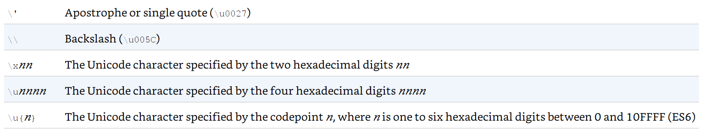

# CIDM3372

CSS and JavaScript

# CSS

[CSS in Depth by Keith J. Grant](https://www.manning.com/books/css-in-depth)

[CSS Book code respository](https://github.com/CSSInDepth/css-in-depth)

## Chapters 1 - 3

Basics and Box Model

## Chapters 4 - 8

Mastering layout

### Chapter 4 - Floats

Floats were originally intended to mimic text flowing around a container (usually an image).

They were the only viable tool for flexible layouts for a long time.

### Chapter 5 - Flexbox

How containers allow for growing and shrinking.

### Chapter 6 - Grid

Using grid to more precisely divide and specify page-wide layout.

### Chapter 7 - Positioning

Within containers, further positioning of elements.

### Chapter 8 - Responsive Design

Exercising more control over layout in response to viewport/device properties.

# JS

[JavaScript: The Definitive Guide, 7th Edition by David Flanagan](https://www.oreilly.com/library/view/javascript-the-definitive/9781491952016/)

[JS Book code repository](https://github.com/davidflanagan/jstdg7)

## Chapter 2 Basics and Running Code

Javascript is typically run within a browser as the browser hosts scripts.  Therefore, for basic coding, we have a few options:

* Create an HTML page an then code within it to use the browser
* Use the browser's [Developer Tools](https://developers.google.com/web/tools/chrome-devtools/) to run JS code in the console there
* Use [NodeJS](https://nodejs.org/en/)

I will demonstrate each.

### Language Basics: Lexical Structures

There are some JavaScript basics in terms of structure that are easy to work through.

### Comments

A comment is any content in a script or page that you don't have interpreted/read by the browser.  They are for documenting code and making notes.

``` javascript
// This is a single-line comment. 
/* This is also a comment */ 

/** 
  * This is a multi-line comment. The extra * characters at the start of 
  * each line are not a required part of the syntax; they just look cool! 
  */
```

### Literal Values

We can **hard code** values into our JS code as well

``` javascript
12 // The number twelve 
1.2 // The number one point two 
"hello world" // A string of text 
'Hi' // Another string 
true // A Boolean value 
false // The other Boolean value 
null // Absence of an object

```

### Identifiers (variable names) and reversed workds/names

You can use letters, underscores, or dollar signs to start a variable name.  Then, you can use numbers, letters, dollar signs, or underscores:

``` javascript
i 
my_variable_name 
v13 
_dummy 
$str

```

There are reserved words, that indicate how JavaScript should work, that are not allowed to be used in your identifiers.

``` javascript
as const export get null target void 
async continue extends if of this while 
await debugger false import return throw with 
break default finally in set true yield 
case delete for instanceof static try 
catch do from let super typeof 
class else function new switch var
```

### Unicode provides support for an extended character set

We can use symbols and languages other than english for our indentifiers:

``` javascript
const π = 3.14;   // symbol
const sí = true;  // espanol
```

We can use unicode escape sequences - by using the hexadecimal value for the unicode character/symbol:

``` javascript
console.log("\ u{ 1F600}"); // Prints a smiley face emoji
```

### Semicolons as statement terminators

Although optional, your code is more readable and emphatic if you use them.

## Chapter 3 Types, Values, and Variables

This chapter is all about the types of data you store in a variable (identifier), as all identifiers are associated with something you want to save and refer to later.

JavaScript is, generally, not a strong-typed language which gives some flexibility as values are interpreted/assessed when your code runs.

However, there are some basic categories.

* Primitive Types
  * numbers
  * strings
  * booleans
  * null
  * undefined
* Object Types
  * everything else that is not a primitive
  * typically, a collection of properties - identifier + value
  * Arrays - a sequence of primitives or objects
  * Sets - set of values
  * Map - key/value pairs
  * RegExp - regular expression
  * Date - working with time and date
  * Error - encapsulates a code error with causes, information, and descriptions of the error
  * Classes
  * Functions

#### Interpreted Languages and Memory Management

JavaScript handles memory management and object/value disposal (called **Garbage Collection**) for you. Most JavaScript intepreters (called an *Engine*) run in a browser.

### Object-Orientation

JavaScript is an Object-Oriented language in that you can specify classes and prototypes from which you may then generate objects.  Then, you can *contain* variables in one place.

### Declaration of Variables

There are, generally, three ways that you declare that you'd like to store a value with an identifier:

  * `const` - declaring a value that you do not want to change for its lifetime
  * `let` - declaring a value that can change during its lifetime
  * `var`- older way of using `let` - will be commonly found in older JavaScript code.  It still works.

  David Flanagan has this to say about when to use `const` and when to use `let`:

  > There are two schools of thought about the use of the const keyword. One approach is to use const only for values that are fundamentally unchanging, like the physical constants shown, or program version numbers, or byte sequences used to identify file types, for example. Another approach recognizes that many of the so-called variables in our program don’t actually ever change as our program runs. In this approach, we declare everything with const, and then if we find that we do actually want to allow the value to vary, we switch the declaration to let. This may help prevent bugs by ruling out accidental changes to variables that we did not intend. In one approach, we use const only for values that must not change. In the other, we use const for any value that does not happen to change. I prefer the former approach in my own code.
  > David Flanagan - JavaScript: The Definitive Guide - 8th Edition, Page 53

## The Primitive Types

The primitive types cover most of the values you'd expect to encounter and store.  Object types are often collections of these values.

JavasScript uses the IEEE 754 standard to hold numbers as 64-bit floating point or 32-bit integer values.

### Separators

A cool feature of JavaScript - but is not standardized - is the ability to visually separate larger numbers with underscores:

``` javascript
let billion = 1_000_000_000;
```

### Math Object

Many basic math functions are provided in the [Math Object](https://developer.mozilla.org/en-US/docs/Web/JavaScript/Reference/Global_Objects/Math).

### BigInt

The "Big Int" notation allows you to specify that you'd like a full 64 bits to hold an integer:

``` javascript
1234n // A not-so-big BigInt literal 
0b111111n // A binary BigInt 
0o7777n // An octal BigInt 
0x8000000000000000n // = > 2n** 63n: A 64-bit integer

BigInt( Number.MAX_SAFE_INTEGER) // = > 9007199254740991n 
let string = "1" + "0". repeat( 100); // 1 followed by 100 zeros.
BigInt( string) // = > 10n** 100n: one googol
```

### Dates

Since time is considered a continuum, then we measure time and dates using a numeric value of some unit of time since an epoch beginning that is, usually, artibrarily set.  In the computing world, the start of the epoch is either January 1, 1970 (Unix World), or January 1, 1980 for the Microsoft world.  A timestamp is often the number of seconds or milliseconds that have expired since the beginning of the epoch.

[JavaScript Date Object](https://developer.mozilla.org/en-US/docs/Web/JavaScript/Reference/Global_Objects/Date)

## Strings and Text

JavaScript stores characters as 16-bit unicode using the UTF-16 standard. This makes for some fun things:

``` javascript
let euro = "€"; 
let love = "❤"; 
euro.length // = > 1: this character has one 16-bit element 
love.length // = > 2: UTF-16 encoding of ❤ is "\ ud83d\ udc99"
```

### String Literals

You will frequently use strings your your project that you "hard code" as *string literals*.

``` javascript
"" // The empty string: it has zero characters 
'testing' 
"3.14" 
'name =" myform"' 
"Wouldn't you prefer O'Reilly's book?" 
"τ is the ratio of a circle's circumference to its radius" 
`" She said 'hi'", he said. `
```

### Escape Sequences



### String Objects and API

There is a broad number of built-in methods and operators for working with strings.

These are all found in the JavaScript [String Object](https://developer.mozilla.org/en-US/docs/Web/JavaScript/Reference/Global_Objects/String).

### Template Literals for String Interpolation

Sometimes, you want to format or insert variable values into a strong, the modern JavaScript approach to this is to use *template literals*:

``` javascript
let name = "Bill"; 
let greeting = ` Hello ${ name }. `; // creates "Hello Bill."
```

### Regular Expressions

A regular expression (RegExp) is used to match patterns in strings. Regular expressions are complex and require time and practice to master.

``` javascript
/^ HTML/; // Match the letters H T M L at the start of a string 
/[ 1-9][ 0-9]*/; // Match a nonzero digit, followed by any # of digits 
/\ bjavascript\ b/ i; // Match "javascript" as a word, case-insensitive

let text = "testing: 1, 2, 3"; // Sample text 
let pattern = /\ d +/ g; // Matches all instances of one or more digits 
pattern.test( text) // = > true: a match exists 
text.search( pattern) // = > 9: position of first match 
text.match( pattern) // = > [" 1", "2", "3"]: array of all matches 
text.replace( pattern, "#") // = > "testing: #, #, #" 
text.split(/\ D +/) // = > [""," 1"," 2"," 3"]: split on nondigits
```

## Booleans

True and False.

Comparisons:

`===` is to absolutely compare two values and the result of using this operator is `true` or `false`

## null and undefined

***null*** is used to indicate the absence of an expected object value associated with an identifier/value.
***undefined*** suggests that no value has yet been initialed in the memory associated with an identifer/value.

## Symbols as Identifiers

We can use a new type in JavaScript called a [Symbol](https://developer.mozilla.org/en-US/docs/Web/JavaScript/Reference/Global_Objects/Symbol) to serve as an identifier for properties or values.  They are guaranteed to be unique.

``` javascript
let strname = "string name"; // A string to use as a property name 
let symname = Symbol(" propname"); // A Symbol to use as a property name 
typeof strname // = > "string": strname is a string 
typeof symname // = > "symbol": symname is a symbol 
let o = {}; // Create a new object 
o[strname] = 1; // Define a property with a string name 
o[symname] = 2; // Define a property with a Symbol name 
o[strname] // = > 1: access the string-named property 
o[symname] // = > 2: access the symbol-named property
```

These are not necessary to use, but are perhaps an interesting development in the language.

## Global Object

The built-in objects in JavaScript, all types, and several useful utility methods are all contained in the [Global Object](https://developer.mozilla.org/en-US/docs/Web/JavaScript/Reference/Global_Objects).

## Type Conversions

It is useful to know what JavaScript's expected behaviors are when you want to convert between the basic primitive types in JavaScript.

